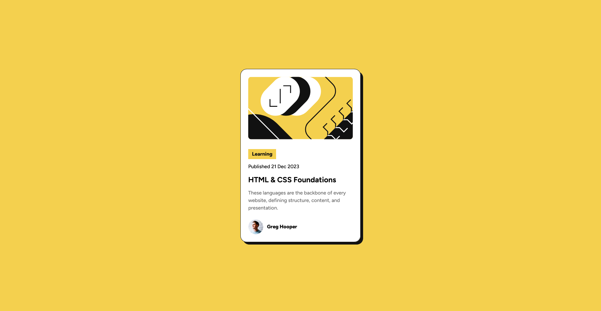

# Frontend Mentor - Blog preview card solution

This is a solution to the [Blog preview card challenge on Frontend Mentor](https://www.frontendmentor.io/challenges/blog-preview-card-ckPaj01IcS). Frontend Mentor challenges help you improve your coding skills by building realistic projects.

## Table of contents

-   [Overview](#overview)
    -   [The challenge](#the-challenge)
    -   [Screenshot](#screenshot)
    -   [Links](#links)
-   [My process](#my-process)
    -   [Built with](#built-with)
    -   [What I learned](#what-i-learned)
    -   [Continued development](#continued-development)
    -   [Useful resources](#useful-resources)
-   [Author](#author)

## Overview

### The challenge

Users should be able to:

-   See hover and focus states for all interactive elements on the page.

### Screenshot



### Links

-   [View my solution on Frontend Mentor](https://www.frontendmentor.io/solutions/blog-preview-card-IMgMJSq9L2)
-   [Live site](https://fakeyet.github.io/Blog-Preview-Card/)

## My process

### Built with

-   Semantic HTML5 markup
-   CSS custom properties
-   Flexbox
-   Mobile-first workflow

### What I learned

I gained a better understanding of creating responsive layouts using **Flexbox**. Additionally, I refined my use of CSS custom properties to manage colors and typography more effectively.

```css
.category {
    display: flex;
    padding: 0.4rem 1.2rem;
    color: var(--gray-950);
    background-color: var(--yellow);
    font-weight: 800;
    align-self: flex-start;
}
```

### Continued development

I want to continue improving the following:

1. **Accessibility (A11y):** To make sure all interactive elements are easily accessible via keyboard and/or screen readers.
2. **CSS Performance:** Using tools like CSS audit plugins to reduce unused styles and optimize my code further.

### Useful resources

-   [CSS Tricks - Flexbox Guide](https://css-tricks.com/snippets/css/a-guide-to-flexbox/) - This was instrumental in helping me structure the layout for this challenge.
-   [MDN Web Docs - CSS Custom Properties](https://developer.mozilla.org/en-US/docs/Web/CSS/--*) - Helped me understand how to use and manage CSS variables effectively.

## Author

-   GitHub - [FakeyeTami](https://github.com/FakeyeTami)
-   Frontend Mentor - [@FakeyeTami](https://www.frontendmentor.io/profile/FakeyeT)

---

### Questions You Had:

1. **Screenshot tips:**

    - Use your browser's screenshot feature or tools like FireShot.
    - Resize the window for mobile or desktop views before capturing to represent responsiveness clearly.
    - Save and add the screenshot to `./assets/images/screenshot.jpg`.

2. **Challenge links:**
    - Add the solution URL on Frontend Mentor after submitting your solution.
    - For the live site, deploy on GitHub Pages or Netlify and include the link.

Let me know if you’d like help with deployment or screenshot specifics!
